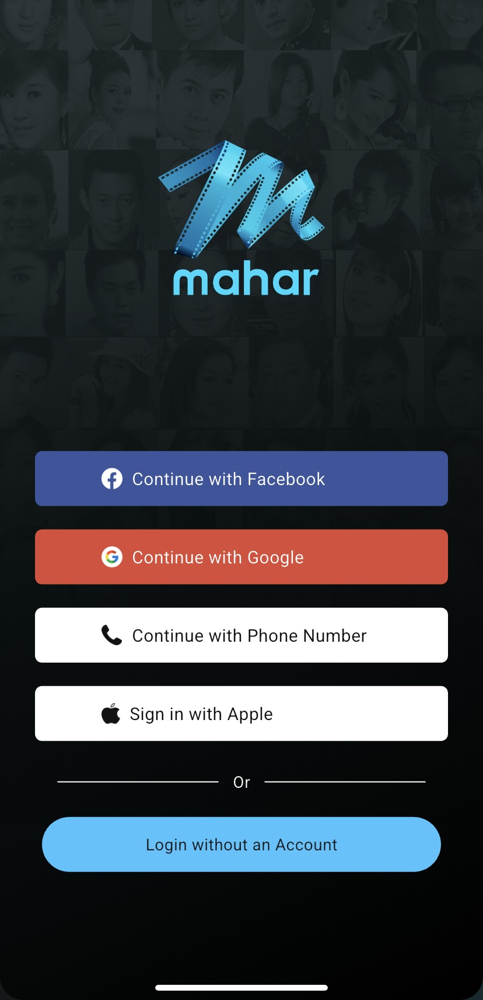
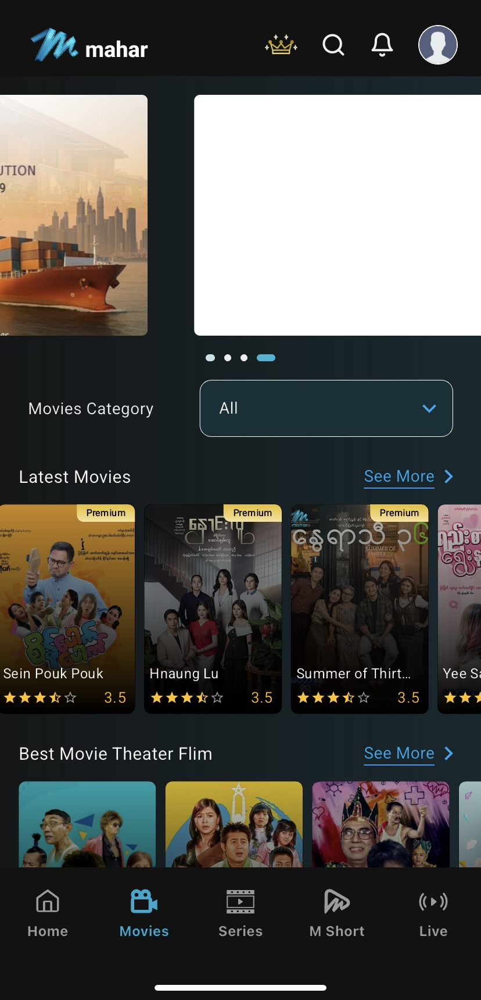
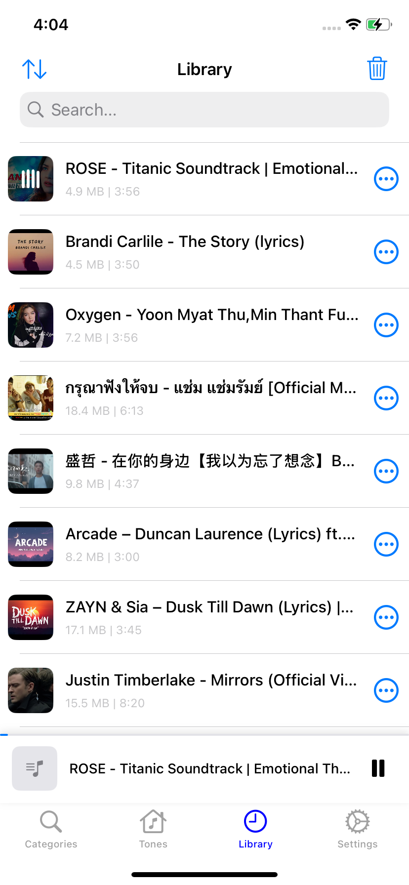
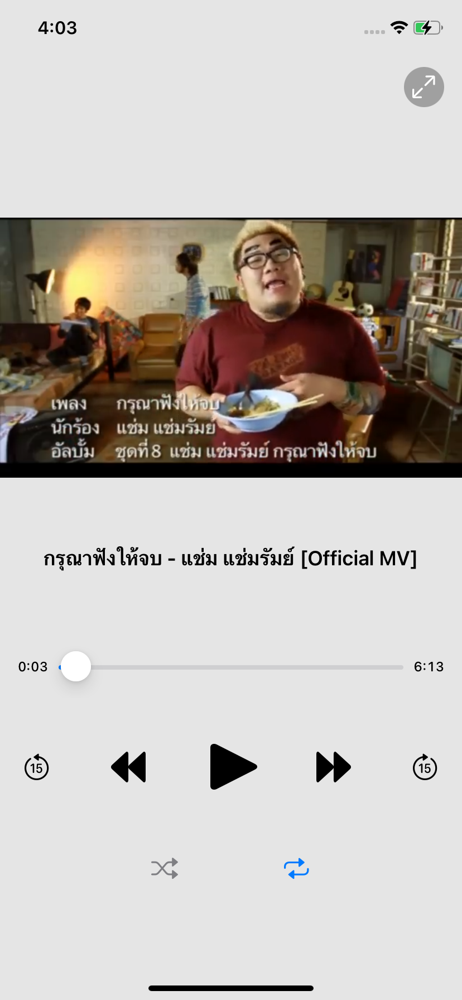
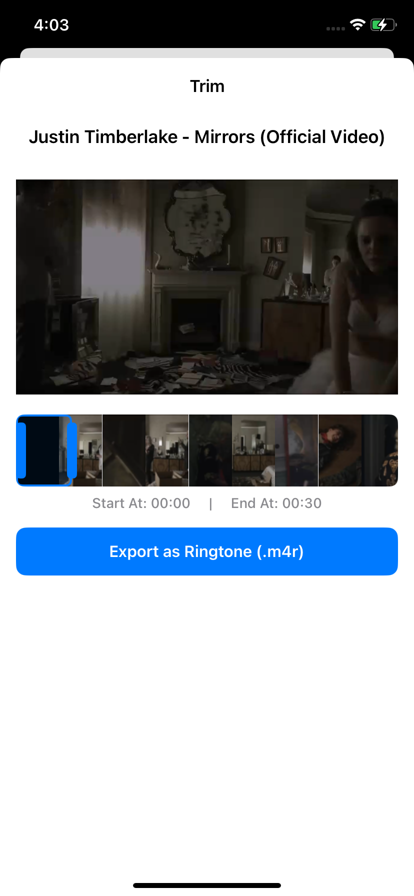
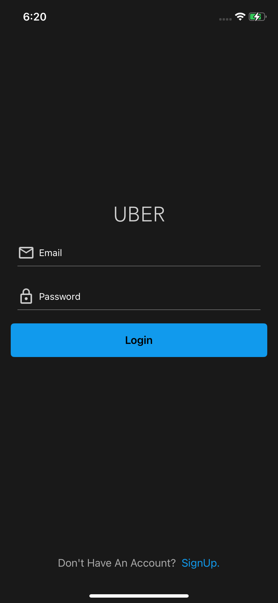
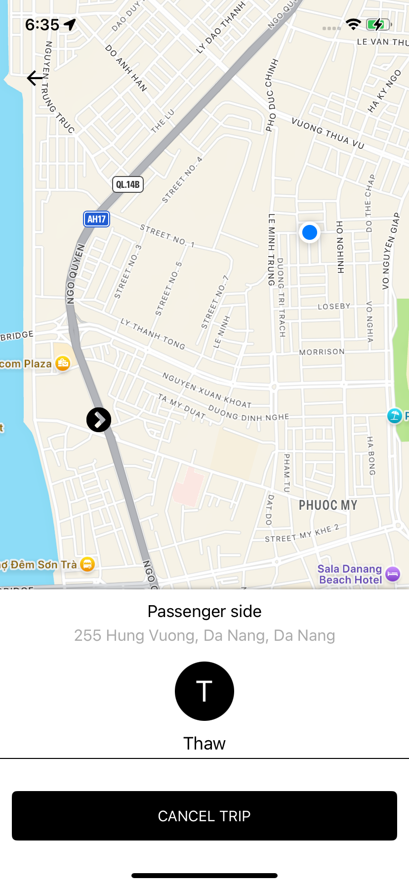
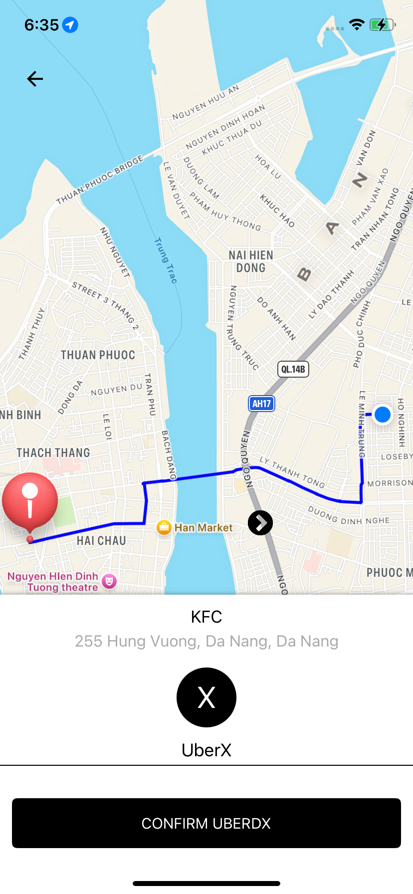
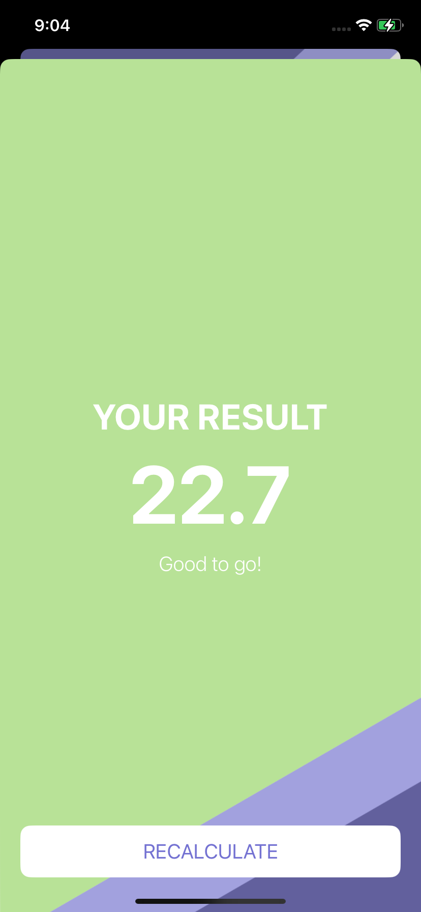
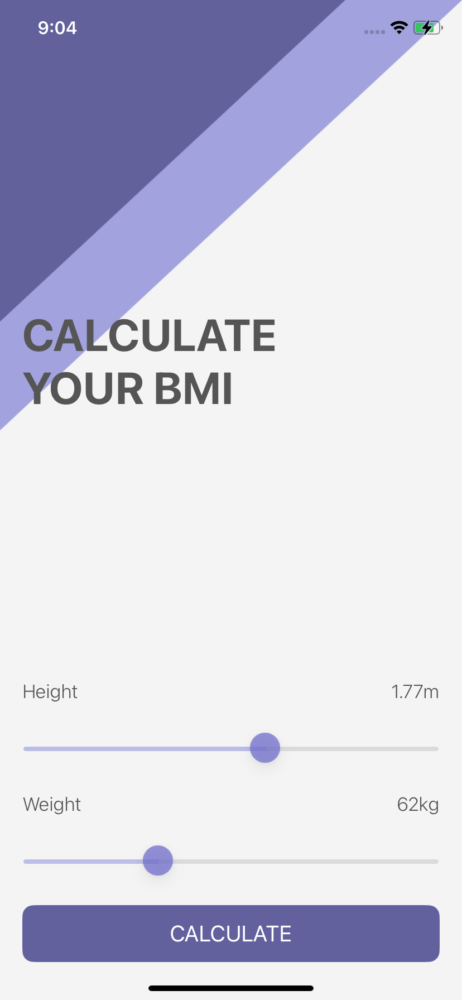

## Hi there, I'm Soe Min Htut 👋

  

## 🚀 iOS Developer

>I've extensive experience as a **iOS application Developer** since 2021, with proficiency in **Swift, UIKit and SwiftUI, Laravel** for backend development.

### 💼 Currently
- 🎶 Working on **ListenUp** - Media & Ringtone Management App
- 🌱 Learning **SwiftUI** and advanced iOS patterns
- 💡 Exploring **Combine** framework and reactive programming

---

## 🛠️ Tech Stack

### Mobile Development

### Backend & Database

### Cloud & Services

### Tools & Workflow

---

## 📱 Featured Projects

### [Mahar Mobile](https://apps.apple.com/sg/app/mahar-mobile/id1437972773) - Movie Streaming App
**iOS and Backend Developer** | Feb 2020 - Aug 2022

- 📺 Built full-featured streaming app with offline downloads and multimedia playback
- 💳 Integrated 4 payment gateways (Telenor, MPT, Ooredoo, Mytel)
- 📊 Achieved **10,000+ downloads** on App Store

## 📸 App Screens

  
  

**Tech:** `Swift` `UIKit` `Stroyboard` `Firebase` `Laravel` `Payment Gateway Integration`

---

### ListenUp - Media & Ringtone App
**Freelance Project** | Apr 2025 - Present

- 🎵 User able to download and save locally and manage to play on background or convert tone
- 📥 Custom download manager and pre-built tone with real-time progress tracking
- 🔄 Reactive UI with Combine framework

## 📸 App Screens

  
  
  

**Tech:** `Swift` `UIKit` `Realm` `Combine` `URLSession` `WKWebView` `Laravel` `MySQL` `Digital Ocean`

---

### Uber Clone
**Learning Project** | 2024

- 🚗 Ride-hailing app built entirely programmatically (no Storyboards)
- 📍 Real-time driver tracking with MapKit
- 🗺️ Location services and trip request management
- 🔐 User authentication with Firebase

  
  
  

**Tech:** `Swift` `Firebase` `MapKit` `Programmatic UI`

---

### BMI-Calculator 
**Learning Project**

- ⚕️ Based on the user’s weight and height it will calculate their body mass and give a piece of health advice.

  
  

**Tech:** `Swift` `Firebase` `MapKit` `Programmatic UI`

---

### Instagram Clone
**Learning Project** | 2023

- 📸 Social media app with photo uploads and real-time feed
- 👤 User authentication and profile management
- ❤️ Likes, comments, and social interactions
- 🏗️ Clean MVVM architecture with Firebase backend

**Tech:** `Swift` `MVVM` `Firebase` `Firestore`

---

## 🎓 Education & Certifications

- 📜 **Diploma in InfoComm Technology** - PSB Academy (2024-2025)
- 🎓 **B.Sc in Physics** - West Yangon University (2014-2018)

---
